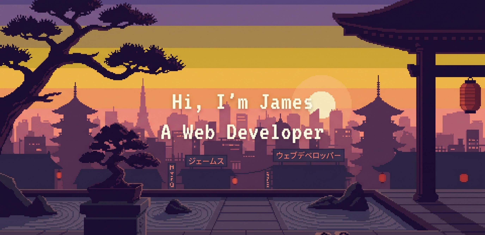

<!-- GREETING HEADER -->

  

   
   

  

    Hello, I'm an IT undergraduate from Holy Angel University based in Pampanga, Philippines 🇵🇭. I'm primarily a Frontend Web Developer, but I'm fully capable of working across the Full Stack. I am currently looking for internships to further apply my knowledge in real-world environments.
  

  

    
    
    
  

### Technology Stack

  
  
  
  
  
  
  
  
  
  
  
  
  
  
  
  
  
  
  

---

  
Feel free to check out my <a href="https://www.james-michael.dev">Portfolio Website</a>, Reach out via <a href="mailto:duquejames657@gmail.com">email</a>, or connect on <a href="https://www.linkedin.com/in/james-michael-duque-100154350/">LinkedIn</a>!

